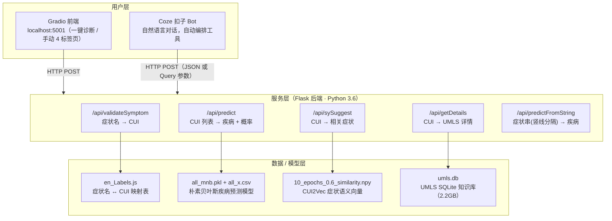
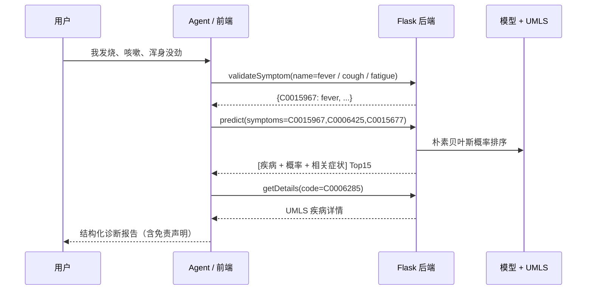

# 基于医学知识库与机器学习的辅助诊疗系统

[](https://www.python.org/)
[](https://flask.palletsprojects.com/)
[](https://www.docker.com/)
[](LICENSE.md)

一个从 0 到 1 的「症状 → 疾病预测」全链路项目。输入症状（中文 / 英文），系统自动完成 **症状标准化（UMLS CUI）→ 疾病预测（朴素贝叶斯）→ 相关症状推荐（CUI2Vec 语义相似）→ 疾病详情查询（UMLS 数据库）**，一次输出完整诊断报告；同时可被 **Coze（扣子）低代码 Agent** 以 4 个「工具 / 工作流」方式自动编排调用，实现"用户说人话 → Agent 自己调工具 → 出诊断报告"。

> ⚠️ **免责声明**：本项目为学习 / 科研原型系统，仅供技术演示，**不构成任何医疗建议**；不能用于确诊、开药或替代医生。出现急症请立即就医。

---

## ✨ 项目亮点

| 角度 | 说明 |
| --- | --- |
| 全链路 | 数据清洗 → 模型训练 → REST API → 前端 / Agent → Docker 云端部署，全流程闭环 |
| 可解释 | 每个结果都来自"模型概率 + 标准医学知识库"，可追溯，而非黑盒 |
| 可私有化 | 模型在本地推理、**不调用任何外部大模型 API**、零推理费用、数据不出域 |
| 标准编码 | 用 UMLS CUI 统一"同一症状多种叫法"（发烧 / fever / pyrexia → C0015967） |
| 体验升级 | 一键诊断把用户操作从 4 步（手动复制 CUI）降到 1 步 |
| Agent 化 | 把确定性能力封装为 4 个 Coze 工作流工具，由 LLM 编排成"诊断 Agent" |

---

## 系统架构



### 核心交互流程



> 说明：`/api/predict`、`/api/sySuggest`、`/api/getDetails` 这三个环节接收的是 **CUI（概念唯一标识）**，而 `validateSymptom` 负责把自然语言症状名转成 CUI——这正是本系统打通"人话 → 机器推理"的关键设计。

---

## 技术栈

| 类别 | 选型 | 用途 |
| --- | --- | --- |
| 后端 | Python 3.6 + Flask | 提供 5 个 REST API |
| 前端 | Gradio / Streamlit | 浏览器交互界面（一键诊断 + 手动模式） |
| 预测模型 | scikit-learn `MultinomialNB` | 疾病概率排序（本地训练，非大模型） |
| 语义模型 | Keras skip-gram（CUI2Vec） | 训练症状向量，做相关症状推荐 |
| 知识库 | UMLS（SQLite, CUI 体系） | 症状/疾病标准化与详情查询 |
| 部署 | Docker + 云服务器 | 容器化一键部署，公网可访问 |
| Agent | Coze 扣子（4 个工作流） | 把后端能力包成工具，由 LLM 编排 |

---

## 项目结构

```text
medical-diagnosis-assistant/
├── app_1119.py             # Flask 后端主服务（端口 7680，本项目实际运行版本）
├── app.py                  # 上游原版后端（端口 5000，仅作对照）
├── app_gradio.py           # Gradio 前端（端口 5001，含「一键诊断」）
├── medical_frontend.py     # Streamlit 前端（备选界面，端口 8501）
├── medical_call.py         # 后端接口命令行测试工具
├── helper.py               # 后端工具函数（CUI 校验 / 模型加载 / UMLS 查询封装）
├── relatedSymptoms.py      # CUI2Vec 症状向量训练脚本（Keras skip-gram）
├── generateLabels.py       # 从 umls.db 生成 en_Labels.js 症状映射表
├── cui2vec-converter.py    # CUI 词向量格式转换脚本
├── train.py                # 朴素贝叶斯疾病预测模型训练脚本
├── en_Labels.js            # 症状英文名 ↔ CUI 映射表（症状验证用）
├── DiseaseSymptomKB.csv    # 疾病-症状 数据（外来补充源）
├── disease-symptom-db.csv  # 疾病-症状 数据（主数据源）
├── disease-symptom-merged.csv # 合并后的训练数据
├── data/
│   ├── README.md           # 数据文件说明与获取方式
│   └── all-files-for-ml/   # 模型运行所需文件（pkl / npy / csv，随仓库提供）
├── umls/                   # UMLS 工具模块（开源，Apache 2.0）
│   └── databases/          # umls.db 放置处（2.2GB，需单独获取，不入库）
├── docs/                   # 项目文档（PRD / 复盘 / Coze 接入 / 部署）
├── server_start.sh         # 一键启动脚本（前端 + 后端）
├── Dockerfile              # 上游对照版（端口 5000，仅供对照）
├── Dockerfile.deploy       # 本项目云部署镜像（端口 7680，华为云 PyPI 源）
├── docker-compose.yml      # 上游 compose（端口 5000）
├── requirements.txt        # 后端 Python 依赖
├── frontend-requirements.txt # 前端 Python 依赖
├── .gitignore
└── LICENSE.md              # 许可证说明（混合来源，见文末）
```

---

## 快速开始

### 方式 A：Docker 一键部署（推荐，含云端）

参考 [docs/云服务器部署指南.md](docs/云服务器部署指南.md)。核心思路：

```bash
# 1. 构建镜像（代码目录内）
docker build -f Dockerfile.deploy -t med-backend .

# 2. 启动（挂载 UMLS 数据库）
docker run -d --name med-backend -p 7680:7680 \
  -v $(pwd)/umls/databases:/umls/databases med-backend
```

### 方式 B：本地源码运行

**后端（端口 7680）**

```bash
pip install -r requirements.txt
python app_1119.py
```

**前端（端口 5001）**

```bash
pip install -r frontend-requirements.txt
python app_gradio.py
# 浏览器打开 http://localhost:5001
```

> 前置条件：`umls/databases/umls.db`（约 2.2GB，获取方式见 [data/README.md](data/README.md)）；`data/all-files-for-ml/` 内模型文件已随仓库提供。

---

## API 文档

基础地址：`http://<host>:7680/api`（本地为 `http://localhost:7680/api`）。

> 每个接口都支持 **两种传参方式**（后端已兼容，Coze 低代码平台用 Query 参数更方便）：
> - JSON Body：`POST` + `Content-Type: application/json` + Body
> - Query 参数：`POST` + URL 末尾 `?key=value`（Body 留空）

| # | 接口 | 作用 | 参数 | 说明 |
| --- | --- | --- | --- | --- |
| 1 | `POST /api/validateSymptom` | 症状名 → CUI | `name` | 精确匹配返回 1 个 CUI；否则返回近似匹配列表 |
| 2 | `POST /api/predict` | CUI 列表 → 疾病+概率 | `symptoms` | 多个 CUI 用英文逗号分隔（Query 方式）或传数组（JSON 方式） |
| 3 | `POST /api/sySuggest` | CUI → 相关症状 | `symptom` | 返回余弦相似度 > 0.6 的相关症状 |
| 4 | `POST /api/getDetails` | CUI → UMLS 详情 | `code` | 返回 UMLS 中的术语描述 |
| 5 | `POST /api/predictFromString` | 症状名串 → 疾病 | `symptoms` | 症状名用 `|` 分隔（上游快捷方式） |

### 示例（curl，Query 方式）

```bash
# 1. 症状验证：fever → {"C0015967":"fever"}
curl -X POST "http://localhost:7680/api/validateSymptom?name=fever"

# 2. 疾病预测：fever + cough
curl -X POST "http://localhost:7680/api/predict?symptoms=C0015967,C0006425"

# 3. 相关症状推荐
curl -X POST "http://localhost:7680/api/sySuggest?symptom=C0015967"

# 4. 疾病详情
curl -X POST "http://localhost:7680/api/getDetails?code=C0015967"
```

### 示例（JSON Body 方式）

```json
// validateSymptom
{"name": "fever"}
// predict：symptoms 为 CUI 数组
{"symptoms": ["C0015967", "C0006425"], "text": ""}
// sySuggest
{"symptom": "C0015967"}
// getDetails
{"code": "C0015967"}
```

### 典型响应

```json
// POST /api/predict?symptoms=C0015967,C0006425
[
  {
    "disease": "Bronchopneumonia",
    "disease_cui": "C0006285",
    "prob": 60.4,
    "sy": ["Coughing", "Fever", "Dyspnea"]
  }
]
```

> 也可运行 `python medical_call.py` 用交互式菜单测试以上接口。

---

## 与 Coze（扣子）低代码 Agent 集成

本项目把后端确定性能力封装为 **4 个 Coze 工作流工具**，由一个 LLM Bot 统一编排：

| Coze 工作流 | 后端接口 | 入参 |
| --- | --- | --- |
| validateSymptom | `/api/validateSymptom` | name（症状英文名） |
| predict | `/api/predict` | symptoms（逗号分隔的 CUI 串） |
| sySuggest | `/api/sySuggest` | symptom（CUI） |
| getDetails | `/api/getDetails` | code（CUI） |

效果：用户输入「我发烧两天了，还咳嗽，浑身没劲」→ Bot 自动把中文翻译成英文症状 → 依次调用工具 → 输出带概率的疾病报告。

**完整分步教程（含界面字段、参数表、发布、接入 Bot、人设规则、整链路测试）见：[docs/Coze-工作流接入指南.md](docs/Coze-工作流接入指南.md)**

---

## 数据与模型是怎么来的

**重点（诚实说明）**：本项目 **没有调用任何外部大模型 API**，疾病预测用的是**本地训练的传统机器学习模型** + 标准医学知识库：

1. **疾病预测模型（朴素贝叶斯）**
   训练脚本 [train.py](train.py)：把 `disease-symptom-db.csv` 与 `DiseaseSymptomKB.csv` 合并 → 症状 one-hot 编码（`all_x.csv`）→ 用 `MultinomialNB` 训练出 `all_mnb.pkl`。运行时把输入症状向量化，`predict_proba` 输出每种疾病的概率并降序排列。
2. **相关症状推荐（CUI2Vec 语义向量）**
   训练脚本 [relatedSymptoms.py](relatedSymptoms.py)：用 Keras skip-gram 在"症状-疾病共现语料"上微调 GloVe 预训练向量，得到 `10_epochs_0.6_similarity.npy`；运行时算两两症状向量余弦相似度，> 0.6 即推荐。
3. **知识库（UMLS）**
   `umls.db` 是美国国立医学图书馆（NLM）的 UMLS 数据（CUI 概念体系），负责"症状/疾病 ↔ 标准英文名"的翻译与详情查询，**需单独申请授权，不随仓库分发**。

> 选择传统模型的原因：数据量不大、结果可解释、可离线私有化、零推理成本；项目名中的"大模型"更多是愿景，V2 规划用 LLM 做对话编排与解释（见 [docs/V2-AI-Agent-PRD.md](docs/V2-AI-Agent-PRD.md)），结构化预测仍保留确定性模型兜底。

---

## 文档目录（docs/）

| 文档 | 内容 |
| --- | --- |
| [docs/PRD-产品需求文档.md](docs/PRD-产品需求文档.md) | 产品需求文档：背景、功能、指标、路线图 |
| [docs/项目分析与复盘.md](docs/项目分析与复盘.md) | 项目复盘：技术选型、踩坑、从工具到 Agent 的演进 |
| [docs/Coze-工作流接入指南.md](docs/Coze-工作流接入指南.md) | Coze 4 个工作流 + Bot 编排的完整配置教程 |
| [docs/云服务器部署指南.md](docs/云服务器部署指南.md) | 华为云 + Docker 公网部署步骤 |
| [docs/V2-AI-Agent-PRD.md](docs/V2-AI-Agent-PRD.md) | V2 智能体规划：工具化、RAG、置信度阈值、降级策略 |
| [data/README.md](data/README.md) | 数据文件与大文件获取方式 |

---

## 路线图

- **V1.0（已完成）**：5 个 REST API + Gradio 手动四标签页流程。
- **V1.2（已完成）**：一键诊断——输入症状一次输出完整报告，操作 4 步 → 1 步；中文症状映射。
- **V2.0（进行中）**：接入 Coze 低代码 Agent，LLM 编排 4 个工具，多轮对话 + 自动出报告。
- **V3.0（规划）**：UMLS RAG 解释"为什么"、置信度阈值分档、人机协同 SOP、评测集。

---

## 许可与致谢

- **上游项目**：本项目基于开源项目 [sparrow-platform/disease-diagnostics-engine](https://github.com/sparrow-platform/disease-diagnostics-engine)（Docker 镜像 `jaylohokare/diseases-predictor`）二次开发。
- **`umls/` 模块**：Copyright 2015 Boston Children's Hospital，Apache License 2.0（见 `umls/LICENSE.txt`）。
- **本项目新增代码**（`app_1119.py`、`app_gradio.py`、`medical_frontend.py`、`medical_call.py`、`docs/` 等）：MIT License。
- **UMLS 数据**：版权归 NLM，使用需遵守其授权协议，数据库不随仓库分发（见 [data/README.md](data/README.md)）。

完整说明见 [LICENSE.md](LICENSE.md)。

---

## 常见问题

**Q：仓库里为什么没有 umls.db？**
A：UMLS 数据需向 NLM 申请授权（学术免费），且体积约 2.2GB，不适合入库。获取方式见 [data/README.md](data/README.md)。

**Q：clone 之后能直接跑吗？**
A：补齐 `umls/databases/umls.db` 后即可。`data/all-files-for-ml/` 中的模型文件已随仓库提供，无需重训。

