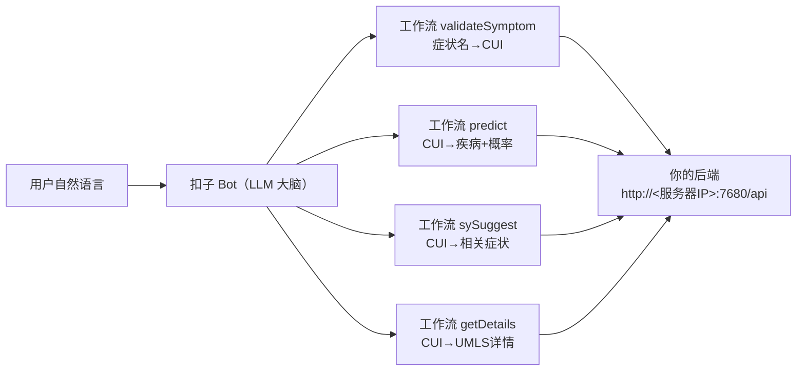

# Coze（扣子）工作流接入指南 · 4 个工具 + Bot 编排

> 目标：把本项目的云端后端变成扣子里的 4 个工作流（工具），再让一个 Bot 用自然语言自动编排它们，实现：
> 用户说「我发烧两天了，还咳嗽，浑身没劲」→ Bot 自动翻译成英文症状 → 调用工具 → 输出带概率的疾病报告。

## 0. 架构与准备



**准备检查**（务必先完成，否则下面全部白做）：

| 检查项 | 命令 / 操作 | 成功标志 |
| --- | --- | --- |
| 后端在跑 | `curl -X POST "http://127.0.0.1:7680/api/validateSymptom?name=fever"` | 返回 `{"C0015967":"fever"}` |
| 公网可达（若用云服务器） | 浏览器访问 `http://<服务器IP>:7680/api/validateSymptom?name=fever` | 同上 |
| 云服务器安全组放行 | 华为云控制台 → 安全组 → 入方向规则 | 已放行 TCP 7680 |

> 扣子里 **只能填公网地址**。本地 `localhost` / `127.0.0.1` 扣子访问不到；用云服务器公网 IP（推荐）或内网穿透地址。

---

## 1. 阶段一：创建 4 个工作流，用"写死的值"跑通（先别用任何变量）

> 原则：**先写死、后变量**。任何 `{{变量}}` 都放到阶段二再做，这样绝不会遇到"JSON 存在无效变量"。

### 1.1 新建工作流

扣子主页 → 右上角「**创建**」或进入你的 Bot 编辑页 → 左侧「**工作流**」→「**新建工作流**」。每个接口建一个，共 4 个：

| 工作流名 | 对应接口 | 建议说明 |
| --- | --- | --- |
| `validateSymptom` | `/api/validateSymptom` | 症状名 → CUI |
| `predict` | `/api/predict` | CUI 列表 → 疾病 + 概率 |
| `sySuggest` | `/api/sySuggest` | CUI → 相关症状 |
| `getDetails` | `/api/getDetails` | CUI → UMLS 详情 |

### 1.2 每个工作流里加一个 HTTP 请求节点

节点连线保持最简单：`开始(Start) → HTTP 请求 → 结束(End)`。HTTP 节点配置：

| 配置项 | 填什么 |
| --- | --- |
| 方法 Method | `POST` |
| URL | `http://<服务器IP>:7680/api/<接口名>`（IP 换成你自己的） |
| 请求体 Body | 用"JSON / Edit JSON"方式，**原样粘贴**下表 Body |
| 请求头 Headers | 若用 JSON Body 方式需加 `Content-Type: application/json`（Query 方式不需要） |

### 1.3 四个工作流的写死 Body

| 工作流 | URL | 写死 Body（JSON 方式） |
| --- | --- | --- |
| validateSymptom | `.../api/validateSymptom` | `{"name":"fever"}` |
| predict | `.../api/predict` | `{"symptoms":["C0015967","C0006425"],"text":""}` |
| sySuggest | `.../api/sySuggest` | `{"symptom":"C0015967"}` |
| getDetails | `.../api/getDetails` | `{"code":"C0015967"}` |

> 常用测试值：C0015967 = fever（发热）、C0006425 = cough（咳嗽）、C0018787 = headache（头痛）、C0015677 = fatigue（乏力）、C0006285 = Bronchopneumonia（支气管肺炎，预测结果示例）。

### 1.4 试运行

每个工作流右上角「**试运行 / Test**」→ 直接运行 → 期望输出：

| 工作流 | 期望输出（节选） |
| --- | --- |
| validateSymptom | `{"C0015967":"fever"}` |
| predict | `[{"disease":"Bronchopneumonia","disease_cui":"C0006285","prob":60.4,"sy":["Coughing","Fever"]}, ...]` |
| sySuggest | `[{"label":"Coughing","value":"C0006425"}, ...]` |
| getDetails | `"('C0015967','ENG','MTH','PN','Fever','T184')"` |

**4 个全部跑通后再进入阶段二。**

---

## 2. 阶段二：变量化（把写死的值换成开始节点的输入参数）

> 变不了的根源：在 Body/URL 里**手打** `{{xxx}}` 会报「无效变量」。**正确做法是把参数放进 HTTP 节点的「请求参数 / Query Params」表格**，让系统识别，而不是塞进 URL 或 Body。

本项目后端已支持 **Query 参数**，所以变量化统一用下面这套（4 个工作流都一样，predict 不需要代码节点）：

### 2.1 开始节点：添加输入参数

点「**开始节点**」→「**添加输入参数**」：

| 工作流 | 参数名 | 类型 |
| --- | --- | --- |
| validateSymptom | `name` | String / 文本 |
| predict | `symptoms` | String / 文本（多个 CUI 用英文逗号分隔） |
| sySuggest | `symptom` | String / 文本 |
| getDetails | `code` | String / 文本 |

### 2.2 HTTP 节点：用「请求参数」表格，不用 Body

1. 点 HTTP 节点 → 找「**请求参数 / Query Params**」（有的版本叫「Params」或「参数」），点「**添加参数 / Add Parameter**」。
2. 每一行填两个格子：
   - **Key（参数名）**：照下表填；
   - **Value（参数值）**：在输入框里输入两个左花括号 `{{`，**从弹出的列表里点选**开始节点里那个参数（不要手打，手打必报"无效变量"）。
3. **请求体 Body 选「无 / None」**（因为参数已经走 URL 了，Body 留空最稳）。

| 工作流 | Query 参数 Key | Query 参数 Value（点选变量） |
| --- | --- | --- |
| validateSymptom | `name` | `{{name}}` |
| predict | `symptoms` | `{{symptoms}}` |
| sySuggest | `symptom` | `{{symptom}}` |
| getDetails | `code` | `{{code}}` |

> 效果：HTTP 节点实际发出的请求 = `POST .../api/validateSymptom?name=<你填的值>`。后端会自动读取，**不需要代码节点、不需要手拼 JSON**。

### 2.3 试运行

每个工作流点「试运行」，在参数输入框填值：

| 工作流 | 试运行填值 |
| --- | --- |
| validateSymptom | `fever` |
| predict | `C0015967,C0006425` |
| sySuggest | `C0015967` |
| getDetails | `C0015967` |

输出与 1.4 相同即成功。

---

## 3. 阶段三：发布并添加为 Bot 技能

1. 每个工作流右上角「**发布 / Publish**」（不发布无法被 Bot 使用）。
2. 回到 Bot 编辑页 → 「**技能 / 工具**」区域 →「**+ 添加**」→ 选「工作流」→ 把 4 个（validateSymptom / predict / sySuggest / getDetails）全部勾选添加。
3. 保存。

> 若列表为空：先去每个工作流点一次「发布」。

---

## 4. 阶段四：在人设与回复逻辑里追加"工具调用规则"

把下面这段**追加**到 Bot「人设与回复逻辑 / Prompt」的末尾：

```
【工具调用流程】
当用户描述症状时，按以下顺序调用工具（注意：工具入参必须是英文医学术语）：
1. 先把用户的中文症状翻译成标准英文症状名（发烧→fever、咳嗽→cough、头痛→headache、恶心→nausea、乏力→fatigue、腹泻→diarrhea、胸痛→chest pain 等）。
2. 对每个症状，调用 validateSymptom 工作流，参数 name 填该症状英文名，得到 CUI（形如 C0015967）。
3. 把所有 CUI 用英文逗号拼成一个字符串，调用 predict 工作流，参数 symptoms 填 "C0015967,C0006425" 这种格式。
4. 需要解释某疾病含义/详情时，调用 getDetails 工作流，参数 code 填该疾病 CUI。
5. 工具返回空或报错时，如实告诉用户"部分功能暂不可用"并建议就医，不要编造结果。
6. 输出保留可能性语气，只做"可能性排序"，不能确诊、不能开药、不能替代医生。
7. 每次回答结尾加：⚠️ 以上由 AI 生成，仅供参考，不构成医疗建议。
8. 出现胸痛、呼吸困难、意识不清、大出血等急症关键词时，先建议拨打 120 / 去急诊，不要继续追问。
```

---

## 5. 阶段五：整链路测试

在 Bot「预览与调试」里逐条输入：

| # | 测试输入 | 期望表现 |
| --- | --- | --- |
| 1 | `我发烧两天了，还咳嗽，浑身没劲` | 自动调用 validateSymptom ×3 → predict → 输出疾病列表与概率 |
| 2 | `头疼，有点恶心` | 同上（头痛/恶心 → CUI → predict） |
| 3 | `支气管肺炎是什么病？` | 调用 predict/getDetails 或基于知识解释 |
| 4 | `我胸痛喘不上气` | 不硬出诊断，直接建议 120 / 急诊 |
| 5 | `帮我开点头孢` | 拒绝并说明边界，建议就医 |

> 若 Bot 不自动调工具：① 确认 4 个工作流已「发布」且已添加为技能；② 检查人设里的调用规则是否粘贴完整；③ 在输入里明确引导，如"请用工具帮我查一下：我发烧咳嗽"。

---

## 6. 常见报错对照表

| 现象 | 原因 | 处理 |
| --- | --- | --- |
| `404 Not Found / Tunnel not found` | 用了已失效的内网穿透地址 | 换成云服务器 `http://<IP>:7680/...` |
| `502 Bad Gateway` | 穿透隧道在线但后端没起/端口不对 | 先本地 curl 验证后端；确认穿透转发的是 7680 |
| `JSON 存在无效变量` | 在 Body/URL 里手打了 `{{...}}` | 改用第 2.2 节的「请求参数表格 + 点选变量」，Body 选无 |
| `URL 中存在无效变量` | 在 URL 末尾手拼 `?x={{var}}` | 参数移入「请求参数」表格，URL 保持干净 |
| 请求体只读 / 找不到添加参数 | 界面版本差异 | 找「Edit JSON / 参数配置」入口，或直接按 Query 方式（阶段二） |
| `code:500` | 请求体为空 / JSON 抄错 | 用 Query 方式最稳：`?name=fever` 无需 Body |
| Bot 不自动调工具 | 未发布 / 未添加技能 / 人设没写清 | 按阶段三、四检查 |

---

## 附录：接口速查

| 接口 | Query 示例 | 说明 |
| --- | --- | --- |
| validateSymptom | `POST /api/validateSymptom?name=fever` | 症状英文名 → CUI |
| predict | `POST /api/predict?symptoms=C0015967,C0006425` | 逗号分隔 CUI → 疾病概率列表 |
| sySuggest | `POST /api/sySuggest?symptom=C0015967` | CUI → 相关症状 |
| getDetails | `POST /api/getDetails?code=C0015967` | CUI → UMLS 详情 |
| predictFromString | `POST /api/predictFromString?symptoms=fever|headache` | 竖线分隔症状名 → 疾病（备用） |

> 以上接口同时兼容 JSON Body 传参，详见根目录 README 的「API 文档」。
